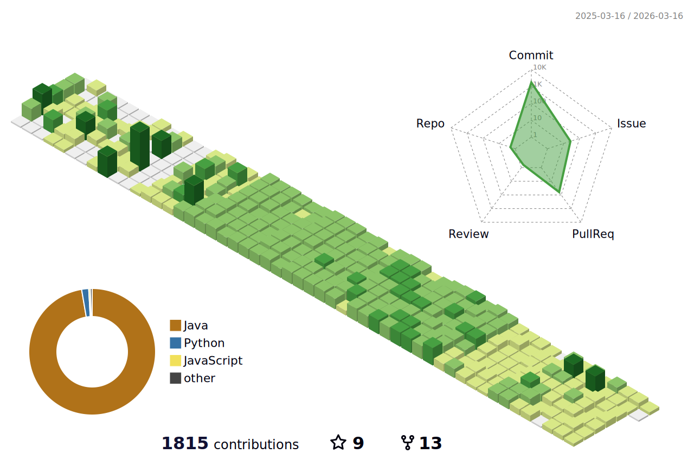

# 🌱 신희을
## 같이 고민하고 같이 성장하는 백엔드 개발자입니다!

### 나를 표현하는 단어 : 다 함께, 열정적으로 
### 자주 듣는 말 : 책임감 있다, 늘 친절하게 도와준다
 

| 기간             | 프로그램                            | 링크                                      |
|------------------|-------------------------------------|-------------------------------------------|
| 2023.03~2023.08  | KUIT-1                              | [KUIT-1](https://github.com/KUIT-1)      |
| 2023.07~2023.09  | 현대 자동차 그룹 소프티어 부트캠프 2기 | [Softeer Bootcamp-2nd](https://github.com/softeerbootcamp-2nd) |
| 2024.03~2024.09 | 신한 투자 증권 프로 디지털 아카데미 4기    | [Pda 4th Front Project](https://github.com/CheatSOL) [Pda 4th Back Project](https://github.com/StockmonGo)|

 

# 🥇 가장 좋아하는 프로젝트

## <a href="https://github.com/ShinHeeEul/A4-FourEver">   A4Fourever  </a>  - 현대 자동차 내 차 만들기 사이트 개선

    <h3> # 인프라 # 백엔드 # 툴 선택 고민 # 성능 고민 # 부하 테스트 # 쿼리 최적화 # 팀에 맞는 협업 방법 </h3>

#### 📆 기간 : 2023.07 ~ 2023.08 (1달)
#### 🤵 담당 역할 : 인프라 및 백엔드 개발자 (인프라 전담, 로그인 및 내 차 만들기 사이트 API 개발)

#### 🚀 좋아하는 이유
  - **툴 선택과 버전 선택의 중요성**을 깨닫고 고려한 프로젝트
  - **성능**에 대한 고민을 하고 **부하 테스트 및 최적화**를 적용한 프로젝트
  - **팀에 맞는 협업 방법**을 고민하고 적용한 프로젝트
  - **기술적 토론의 즐거움**을 알려준 프로젝트

## <a href="https://github.com/CheatSOL">   칫쏠</a> - 검색어와 연관된 주식 추이와 SNS 검색량 추이를 비교 분석하는 사이트

    <h3># 인프라 # 풀 스택 # 캐싱 # 코드 분석 # 리팩토링 # 공동의 목표 # 부하 테스트 <a href="https://github.com/CheatSOL/.github/wiki"> # 위키 관리 </a> </h3>

#### 📆 기간 : 2024.06 ~ 2024.07 (1달)
#### 🤵 담당 역할 : 인프라 및 풀 스택 개발자 (인프라 전담 및 통합 페이지 구현)
#### 🚀 좋아하는 이유
  - 처음으로 **풀 스택 개발자**로 활동한 프로젝트
  - 프로젝트가 끝나고도 **1달간 서비스**를 해 본 프로젝트
  - 협업을 위해 **WiKi 관리** 등 문서 작성에도 진심으로 임한 프로젝트
  - **타인의 코드를 읽고 이해하는 능력** 이 많이 요구된 프로젝트
  - **오픈 API의 불안정성과 성능**에 대해 고민하고 **캐싱**을 적용한 프로젝트
  - **부트캠프 내 1등**이라는 노력의 결과를 얻은 프로젝트

# 🔥 기술 스택

## 💻 백엔드

## 🔣 인프라

## 🧰 도구

 

# 📶 기술 스텟

# ✉️ 연락 방법

)

