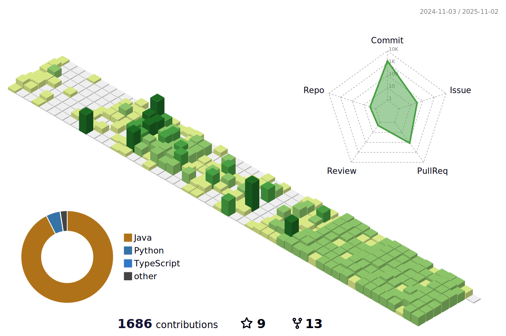

# 🌱 신희을
## 같이 고민하고 같이 성장하는 신희을입니다!

### 나를 표현하는 단어 : 다 함께, 열정적으로 
### 자주 듣는 말 : 책임감 있다, 늘 친절하게 도와준다
 

<!--  -->

| 기간             | 프로그램                            | 링크                                      |
|------------------|-------------------------------------|-------------------------------------------|
| 2023.03~2023.08  | KUIT-1                              | [KUIT-1](https://github.com/KUIT-1)      |
| 2023.07~2023.09  | 현대 자동차 그룹 소프티어 부트캠프 2기 | [Softeer Bootcamp-2nd](https://github.com/softeerbootcamp-2nd) [A4 Fourever](https://github.com/ShinHeeEul/A4-FourEver)|
| 2024.03~2024.09 | 신한 투자 증권 프로 디지털 아카데미 4기    | [Pda 4th Front Project](https://github.com/CheatSOL) [Pda 4th Back Project](https://github.com/StockmonGo)|
| 2024.09~2024.10 | 신한 투자 증권 ICT 운영부 인턴 | [Team Project](https://github.com/Zoozoo-Club) |
| 2025.01~2025.07 | 삼성 청년 SW 아카데미(Ssafy) 13기 |
| 2025.07~2025.12 | 신한 DS |
| 2026.01~ | (주)코스콤 |

  <h2 class="mb-2 h4">Badges</h2>
    
<!--START_SECTION:badges-->

<!--END_SECTION:badges-->

# 🔥 기술 스택

## 💻 백엔드

## 🔣 인프라

## 🧰 도구

 

# 📶 기술 스텟

# ✉️ 연락 방법

)

